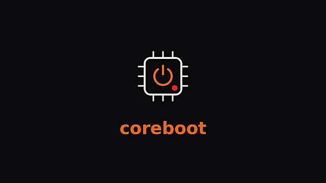

<h1 align="center">coreboot for the ThinkPad T480</h1>

<p align="center"></p>

<p align="center">
  <a href="LICENSE"></a>
  
</p>

coreboot with MrChromebox's EDK2 payload for the ThinkPad T480. You get a real
UEFI with Secure Boot (your own keys, enrolled with sbctl) and a working
discrete TPM 2.0.

Forked from [radleylewis/t480_coreboot](https://github.com/radleylewis/t480_coreboot).
The board config is from there, the build system around it is new.

Tested on a Type 20L5 (mainboard NM-B501). The SPI flash is a Winbond W25Q128,
16 MB, at position U49.

> [!WARNING]
> Flashing firmware can permanently brick your laptop. Everything in this repo
> is provided WITHOUT ANY WARRANTY and without liability for any damage, as
> stated in the [LICENSE](LICENSE) (GPL-3.0, sections 15 and 16). You flash at
> your own risk. Keep a backup of your original flash and never flash anything
> you cannot restore.

## What you need

- podman (the whole build runs in containers)
- flashrom and a CH341A programmer with a SOIC-8 clip for flashing

```bash
sudo pacman -S podman flashrom
```

## Build

Two steps. The first downloads all sources (8-12 GB, needs internet), the
second builds offline:

```bash
./fetch.sh pinned
python3 scripts/build-firmware.py --mode pinned
```

The ROM ends up in `roms/coreboot_t480_pinned.rom`. The first build takes
30-60 minutes because coreboot builds its own toolchain, after that it's fast.

`pinned` uses versions that were tested on real hardware. `latest` fetches the
newest upstream versions instead. Untested, keep a backup ready.

### Your MAC address

The build writes the MAC of the onboard NIC into the GbE region. Read it out:

```bash
ip link show enp0s31f6 | grep ether
```

or from a dump of the original firmware (it sits at offset 0x1000):

```bash
xxd -s 0x1000 -l 6 -p backup.bin | sed 's/../&:/g;s/:$//'
```

Then put it in the `# MAC=` line of `config/defconfig`, or pass
`--mac AA:BB:CC:DD:EE:FF` to the build script. Without a MAC the build aborts.

### Options

| Flag | Effect |
|------|--------|
| `--tpm-reset` | also build a ROM that clears a stuck TPM (see below) |
| `--no-tpm` | build without TPM support |
| `--auto-enroll` | enroll Microsoft's Secure Boot keys instead of Setup Mode |
| `--no-rng` | leave out the RNG |
| `--rebuild-base` | rebuild from scratch after editing `config/defconfig` |

The markers at the end of `config/defconfig` toggle optional devices (SMBus for
the touchpad, HECI1, Fast SPI). A custom boot logo goes into
`config/splash.bmp` (24-bit uncompressed BMP). Both need `--rebuild-base`.

## Flashing

External flashing with the CH341A is the safe way. Laptop fully powered off,
battery disconnected, clip on U49, pin 1 on the dot.

```bash
# read twice and compare - no diff output means good clip contact
sudo flashrom -p ch341a_spi -r backup1.bin
sudo flashrom -p ch341a_spi -r backup2.bin
diff backup1.bin backup2.bin

sudo flashrom -p ch341a_spi -w roms/coreboot_t480_pinned.rom
sudo flashrom -p ch341a_spi -v roms/coreboot_t480_pinned.rom
```

After flashing: reconnect the CMOS battery, boot, set the clock
(`sudo timedatectl set-ntp true`) and add `reboot=pci` to the kernel cmdline.

> [!NOTE]
> The clock matters. Secure Boot key enrollment silently fails if it's wrong.

Internal flashing works too (boot with `iomem=relaxed`), but a failed write
bricks the machine, so keep the programmer at hand:

```bash
sudo flashrom -p internal -r backup.bin
sudo flashrom -p internal --ifd -i bios -w roms/coreboot_t480_pinned.rom
sudo flashrom -p internal --ifd -i bios -v roms/coreboot_t480_pinned.rom
```

If flashrom says the BIOS region is read-only, flash externally.

## Secure Boot

The firmware starts in Setup Mode. Enroll your own keys from Linux:

```bash
sudo pacman -S sbctl
sudo timedatectl set-ntp true
sbctl create-keys
sbctl sign -s /boot/EFI/...      # sign your bootloader/kernel
sbctl enroll-keys -m
sbctl status
```

To keep the settings of a previous coreboot install (keys, boot entries),
either copy the SMMSTORE from a backup into the new ROM:

```bash
python3 scripts/transfer-settings.py backup.bin roms/coreboot_t480_pinned.rom
```

or, when flashing internally, write only the COREBOOT region and leave the
rest of the chip alone:

```bash
sudo flashrom -p internal --fmap -i COREBOOT -w roms/coreboot_t480_pinned.rom
```

## TPM reset

If the TPM is stuck in a vendor-BIOS state (MFG mode, owner auth set,
disableClear latched), build with `--tpm-reset`. That produces a second ROM
that clears the TPM on every boot via TPM2_Clear.

> [!CAUTION]
> TPM2_Clear wipes everything sealed to the TPM (LUKS keys etc.) and cannot be
> undone. The reset ROM clears on every boot: flash it, boot Linux exactly
> once, check the result, then flash the normal ROM back.

```bash
python3 scripts/build-firmware.py --mode pinned --tpm-reset

sudo flashrom -p ch341a_spi -w roms/coreboot_t480_pinned_tpmreset.rom
# boot once, then:
sudo grep -i "TPM-RESET" /sys/firmware/log     # step2/step3 should say rc=0x0
tpm2_getcap properties-variable                # ownerAuthSet, disableClear = 0
sudo flashrom -p ch341a_spi -w roms/coreboot_t480_pinned.rom
```

step1 may report INVALID_POSTINIT, that's fine (coreboot already started the
TPM itself). On systemd 257+ mask `systemd-pcrproduct.service`, the T480's TPM
chip doesn't support what it needs.

## Cleaning up

```bash
podman image prune -a -f
rm -rf sources/
```

The exact versions of a build are recorded in `roms/versions_<mode>.lock`, so
everything can be rebuilt later.

## License

[GPL-3.0](LICENSE), inherited from the upstream project. The sources fetched
during the build (coreboot, EDK2, libreboot) have their own licenses and are
not part of this repo.
